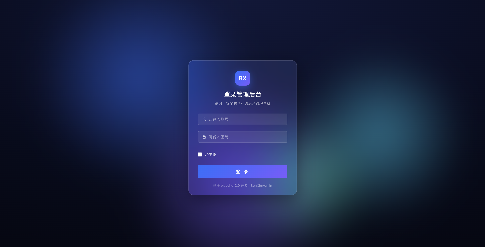
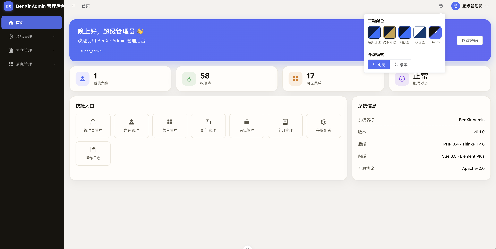
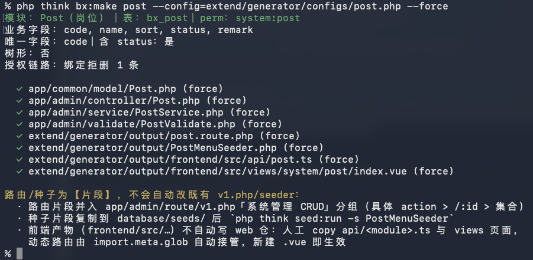
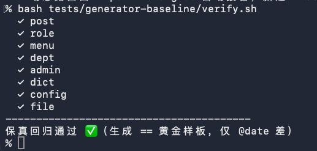

<div align="center">

# BenXinAdmin · 本心通用管理后台底座

**一套可运行的通用管理后台开源底座** —— 用户/权限/系统管理 + **可复刻的代码生成器**，供各类项目（打卡、商城、知识付费等）在其上叠加业务，免重复造公共轮子。

[](LICENSE)


后端仓（本仓） · [后台前端 web](https://gitee.com/binxin-admin/binxin-admin-web) · [C 端 uniapp](https://gitee.com/binxin-admin/binxin-admin-uniapp)

</div>






---

## 🤖 全程 Vibe Coding 实践

本项目架构决策与任务规划由 AI 项目经理产出、编码由 AI 完成、人类负责拍板决策与验收测试。但它不是「无人审查的 AI 吐码」：**高度规范化的架构基线（ADR + 黄金样板）+ 代码生成器 + 可复现的保真回归（`tests/generator-baseline/verify.sh`）+ 全程安全基线**，正是支撑 AI 协作产出一致、安全、可维护代码的基础设施。换句话说——这个项目本身，就是「如何让 AI 稳定产出生产级代码」的一份可运行答卷（质量自证机制见下方「核心特性」与「安全特性」章节）。

---

## ✨ 核心特性

### 🏗️ 代码生成器护城河
一条 `php think bx:make` 从**表结构**直出**全栈产物**：后端四件套（Model / Controller / Service / Validate）+ 路由 + 菜单权限 seeder + 前端列表页 / 编辑表单 / 分配弹窗 / API 薄壳。覆盖**四种范式**——纯 CRUD、树形（递归 CTE 或内存建树）、授权链路（角色分配菜单 + Casbin 同步 + 事务回滚）、数据权限。**「生成 == 手写黄金样板」逐字保真**，回归基线随仓可复现：`bash tests/generator-baseline/verify.sh`。





### 🍖 吃狗粮闭环
生成器不是玩具——真实业务（内容、系统公告等）就是 `bx:make` 生成的。「先手写黄金样板 → 暴露缺口回炉生成器 → 业务模块零手工自动复刻」闭环成立：例如富文本净化能力，手写内容模块沉淀 → 回炉进生成器 → 系统公告模块自动复用，零手工接线。

### 🔐 安全基线全程贯穿
JWT 双 guard 物理隔离、Casbin RBAC、数据权限五档、三方密钥 AES 入库、富文本 XSS 净化、上传双重校验、支付回调四件套、多维限流防刷——每项均已落地并过模块级验收，**系统化清单见下方「🔐 安全特性」章节**。

### 🎨 资源合规·可放心商用
全程**未嵌入任何商业付费字库**（正文系统字体栈、零嵌入，需品牌字仅用 OFL 开源字体如思源黑体/MiSans/Inter）；图标仅用 Element Plus Icons（MIT）/ wot-design-uni 内置 / Iconify 开源集（Remix Apache-2.0 / Tabler MIT / Lucide ISC）；图片仅自有 / CC0 / 框架默认。配合 **Apache-2.0 + 依赖零 AGPL/GPL/SSPL 传染**，整套底座**可直接用于商业项目，无字库 / 图标 / 依赖授权风险**。

### 📱 全栈三端
ThinkPHP 8 后端 + Vue 3 / Element Plus 后台 + uni-app C 端（**一套代码出微信小程序 + H5**）。C 端懒登录：用到核心业务前不强制登录，登录即注册，微信 + 手机号缺一不可。

### 🧩 通用业务底座
内容 CMS（分类树 / 内容 / 广告位 + 富文本净化）+ 微信能力（access_token 中心化缓存 / code2session / 网页 oauth）+ 支付框架（yansongda/pay，订单状态机 / 退款 / 事件解耦）+ 消息（短信渠道 / 验证码 / 系统公告）。**具体业务作闭源上层叠加，不进本仓**（守开源边界）。

---

## 🛠 技术栈

| 层 | 选型 | 说明 |
|---|---|---|
| 后端 | PHP **8.4** + ThinkPHP **8.1**（多应用） | Apache-2.0 |
| 数据库 | MySQL **8**（InnoDB / utf8mb4） | — |
| 缓存 | **Valkey**（Redis 协议兼容，BSD-3） | 替 Redis，规避 AGPL 争议 |
| 鉴权 | **lcobucci/jwt**（BSD-3）双令牌 + **php-casbin**（Apache-2.0） | 自建 BxJwt 服务层承双 guard / 白黑名单 |
| 支付 | **yansongda/pay** v3.7.20（MIT） | 锁定版修回调验签 CVE |
| 富文本 | ezyang/htmlpurifier（LGPL，作依赖不传染） | 后端白名单净化防 XSS |
| 迁移 / 限流 | think-migration + Seeder / think-throttle | 禁裸 SQL |
| 后台前端 | Vue 3.5 + Vite + Element Plus + UnoCSS + Pinia | MIT |
| C 端 | uni-app + Vue3 + TS + wot-design-uni（MIT） | 微信小程序 + H5 |

> 依赖协议全部可商用、无 AGPL/GPL 传染。

---

## 🗂 架构概览

三个**独立仓库**，均 Gitee + GitHub 双开双推：后端（本仓，含代码生成器）/ 后台前端 `benxin-admin-web` / C 端 `benxin-admin-uniapp`。

```
app/
├── common/            # 公共层：基类 / 中间件 / 异常 / 库
│   ├── base/          # BxController / BxModel / BxService / BxValidate（黄金样板四件套基类）
│   ├── middleware/    # RequestLog / Cors / JwtAuth / CasbinAuth / OperLog
│   ├── library/       # BxJwt / Result / ErrorCode / ConfigCrypt / BxCache / 微信·支付·短信
│   └── service/       # CasbinService / BxPay / SmsCodeService / UserAuthService
├── admin/             # 后台应用，对外前缀 /admin
└── api/               # C 端应用，对外前缀 /api
config/  ·  database/{migrations,seeds}  ·  public/
extend/generator/      # 代码生成器（stub + 元数据 → 全栈产物）
tests/generator-baseline/  # 生成器保真回归基线 + verify.sh
docs/ARCHITECTURE.md   # 架构基线与全部约定（权威文档）
docker-compose.yml     # 仅 MySQL + Valkey
```

统一返回（业务码风格 A）：`{ "code":0, "msg":"success", "data":null, "request_id":"uuid", "timestamp":… }`，`code=0` 成功；HTTP 默认 200，结果以 `code` 为准（鉴权类允许 401）。错误码段见 [`docs/ARCHITECTURE.md`](docs/ARCHITECTURE.md) §6.2。

---

## 🚀 快速开始

```bash
# 1. 安装依赖（生产 PHP 8.4）
composer install

# 2. 环境变量
cp .env.example .env
#   必填：SUPER_ADMIN_INIT_PWD（超管初始密码）
#         JWT_ADMIN_SECRET / JWT_API_SECRET（openssl rand -hex 32）
#         CONFIG_CRYPT_KEY（三方密钥 AES 入库密钥，openssl rand -hex 32）

# 3. 启动本地依赖（仅 MySQL:3308 + Valkey:6380，建议 Mac OrbStack）
docker compose up -d

# 4. 建表 + 业务种子（超管 / 菜单 / 字典 / Casbin / 各模块 perms）
php think migrate:run
php think seed:run

# 5. 起服务（独占 8801）
php think run -p 8801
curl http://127.0.0.1:8801/admin/v1/ping     # -> {"code":0,"msg":"pong",...}
```

> ### 🔴 安全必读
> 1. **`SUPER_ADMIN_INIT_PWD` 不设则不创建超管账号**——本底座**无任何默认弱口令**，部署者必须显式设置强密码（超管 `admin` 密码即此值，Argon2id 入库；首登后请立即改密）。
> 2. **生产务必 `APP_DEBUG=false`**（`.env.example` 已默认 false）——调试探针与测试种子均靠它守门，生产不暴露。
> 3. 三方密钥（支付 / 短信 / OSS）**AES 加密入库、不进仓库**；`.env` 已在 `.gitignore`，**严禁提交真实密钥**。

### 首次登录后台

1. 部署前 `.env` 必设 `SUPER_ADMIN_INIT_PWD=<强密码>`——**不设则不创建超管账号、无法登录**（防默认弱口令的设计）。
2. `php think seed:run` 用该密码创建超管账号：用户名 **`admin`**、角色 `super_admin`、Argon2id 加密。
3. 启动后台前端（[benxin-admin-web](https://gitee.com/binxin-admin/binxin-admin-web)，baseURL → 8801），用**用户名 `admin` + 上述密码**登录；首登后请立即在后台改密。
4. 登录契约：`POST /admin/v1/login` → `{ access_token, refresh_token, token_type, expires_in, refresh_expires_in }`（§7）。
5. C 端（[uni-app](https://gitee.com/binxin-admin/binxin-admin-uniapp)）为**懒登录**：微信小程序 `wx.login`+`getPhoneNumber` / H5 公众号 oauth+短信验证码，登录即注册，无需账号密码。

后台前端 / C 端起步见各自仓 README，`VITE_API_BASE(_URL)` 默认指向 `http://127.0.0.1:8801`。

<details>
<summary>本地环境提示（端口隔离 / PHP 版本妥协 / 数据卷）</summary>

- 依赖容器默认映射宿主机 **MySQL 3308 / Valkey 6380**（避开本机原生 3306 / 6379），容器内仍 3306/6379；无冲突可在 `.env` 改回。
- 本地若为 PHP 8.1~8.3，临时 `composer install --ignore-platform-req=php`（仅本地妥协，生产无此项）。
- 首次起容器后再改 `DB_PORT`/账号需 `docker compose down -v` 清卷重起，让 MySQL 按新 `.env` 重新初始化。

</details>

---

## ⚙️ 代码生成器

```bash
# 1) 建好目标表（migration）  2) 可选配模块元数据 extend/generator/configs/<m>.php
# 3) 生成（--output 指向独立目录便于 diff 验收；缺省落真实 app 路径，前端产物落 output/ 人工 copy）
php think bx:make bx_post --config=extend/generator/configs/post.php --output=runtime/generated/post --dry-run
php think bx:make bx_post --config=extend/generator/configs/post.php            # 落地（默认不覆盖，加 --force 覆盖）

# 保真回归（防污染硬门）：重生成八标的与基线逐字比对（仅 @date 差）
bash tests/generator-baseline/verify.sh        # 全 ✓ 即「生成 == 黄金样板」
```

产物 = 后端四件套 + 路由片段 + 菜单 perms seeder + 前端列表/表单/分配弹窗/api 薄壳。八个黄金样板标的（post/role/menu/dept/admin/dict/config/file）的保真基线在 [`tests/generator-baseline/`](tests/generator-baseline/)，clone 即可复现回归。

---

## 🔐 安全特性

以下每项**均已落地并过模块级验收**：

- **认证**：JWT 双令牌（access + refresh），后台 / C 端双 guard 物理隔离（独立密钥 + `aud` + Valkey 独立黑白名单命名空间）；登出黑名单、refresh 白名单。
- **CSRF**：Bearer Token 置于 `Authorization` 头 + 无 Cookie 会话（token 存 storage 非 cookie），跨站请求无法自动携带凭据，**CSRF 天然免疫**；H5 微信 oauth 登录流额外用随机 `state`（写 Valkey 短 TTL、回调比对）防登录 CSRF。
- **授权**：Casbin RBAC（粒度到接口 / 按钮）；数据权限五档（全部 / 本部门 / 本部门及以下递归 CTE / 仅本人 / 自定义），多角色取最宽。
- **密钥**：三方密钥 AES-256 入库、密钥置 `.env` 不进仓库、展示脱敏；git 全历史 0 凭据泄露（pickaxe 核验）。
- **数据**：全程 ORM 参数化、字段白名单防批量赋值、软删唯一键不可复用。
- **XSS 防护**：富文本后端 HtmlPurifier 白名单净化（落库前 clean，堵存储型 XSS 主入口）+ 前端框架默认输出转义（Vue / Element Plus 插值自动转义、不可信内容不走 `v-html`）+ C 端 `rich-text` 渲染不执行脚本——后端净化 + 前端渲染双重防护。
- **上传**：真实 MIME + 扩展名双重校验、重命名、落非 Web 可执行目录。
- **日志**：操作 / 登录全审计 + 脱敏红线（密码 / token / 手机号 / 验证码黑名单 + 语义正则）。
- **支付**：回调四件套（验签 + 幂等 + 金额二次校验 + 状态机合法迁移）。
- **防刷**：登录 / 短信多维限流 + 验证码消费即删 + 错误锁定。
- **生产基线**：`APP_DEBUG=false`、探针 / 测试种子全 `APP_DEBUG` 守门、无默认弱口令、统一异常不泄堆栈。

<details>
<summary>生产加固建议（部署侧，非底座已落地清单——按需配置）</summary>

- **安全响应头**（生产 Nginx / SafeLine 层配）：`Content-Security-Policy`（XSS 纵深）+ `X-Frame-Options`（防点击劫持）+ `X-Content-Type-Options: nosniff` + HSTS + `Referrer-Policy`。
- **密码复杂度策略**：后台 admin 密码强度校验可在应用层补（C 端走微信 + 手机号无密码，不涉及）。
- **依赖持续审计**：开源后建议接 `composer audit` / dependabot 定期盯依赖 CVE。
- **token 存储权衡**：token 存 storage（非 HttpOnly cookie）→ CSRF 天然免疫，但 XSS 可窃取，属「C 端无服务端会话」的取舍，据实说明、不回避。
- **IDOR 提示**：底座 C 端当前仅只读公开内容，无水平越权风险；上层业务若加「我的订单 / 资料」类接口，须按 `user_id` 过滤防越权读他人数据。

</details>

---

## 🧱 开源边界（请勿误解）

- **开源仓只含**：用户 / 权限 / 系统管理 + 基础代码生成器 + 通用业务**框架**（内容 / 支付 / 消息 / 微信配置）。
- **具体业务**（知识付费、商城等）作**独立闭源上层项目**叠加，**不在本仓**。
- 支付等三方密钥加密存储、不进仓库。

---

## 🗺 路线图

| 阶段 | 内容 | 状态 |
|---|---|---|
| M0 | 三端脚手架（后端 / 后台前端 / C 端） | ✅ |
| M1 | 认证基建 + Casbin RBAC + 管理员/角色/菜单/部门/岗位 + 数据权限 | ✅ |
| M2 | 系统管理（字典 / 参数 / 操作·登录日志 / 文件） | ✅ |
| M3 | 代码生成器（四范式保真 + 前端产物） | ✅ |
| M4 | 通用业务（内容 / 微信 / 支付 / 消息） | ✅ |
| M5 | C 端懒登录（认证 / 双端登录闭环 / 首页·我的） | ✅ |
| M6 | （可选）官网 + 首页拖拽搭建；高级生成器 / 企业模板（闭源） | ⚪ |

---

## 📄 协议与署名

[Apache-2.0](LICENSE)（带专利授权条款）。作者 仗键天涯(daxing)。架构基线与全部约定见 [`docs/ARCHITECTURE.md`](docs/ARCHITECTURE.md)。

> 仓库地址（代码内一律写 `BenXinAdmin`，仅 git 地址按实际）：
> Gitee（主）`https://gitee.com/binxin-admin/binxin-admin-server` · GitHub（镜像）`https://github.com/BenXinAdmin-PHP/benxin-admin-server`
